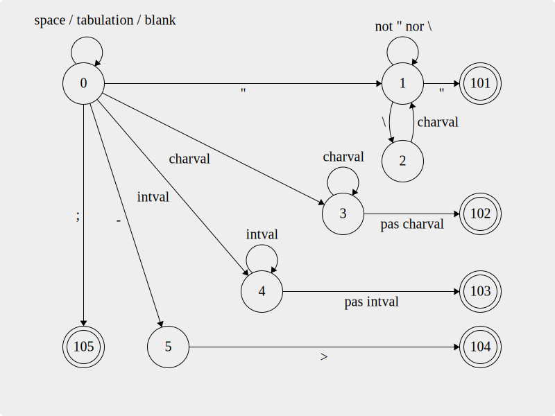

# AdventureLang

This project was developed for our third year of computer science at the University of Tours, France.

The goal was to create a language that describes a game's adventure and then to interpret it. The language itself only describe an adventure and does not implement the game. The language is interpreted by a Java program.

## Getting Started

### Prerequisites

- Java 21 (with support for Preview features like StringTemplates and Switch Expressions).
- We recommend using IntelliJ IDEA as an IDE but you can use any IDE you want.

### Installing

You can either download the project as a zip file or clone it using git.

## The language

### Syntax

The language is composed of 5 main parts : the title, the items, the characters the locations and the actions.

#### General syntax

Each instruction end with a semicolon `;`. The language is case sensitive. The language only accepts integers as numbers and strings must be surrounded by double quotes `"`. The language does not accept comments. You can insert new lines, tabs and spaces wherever you want. In strings, you can use the `\` character to escape the double quotes or any character. The standard escape characters are supported.

- The syntax is case sensitive and ends each instruction with a semicolon (`;`).
- Only integers are allowed for numbers; strings should be enclosed in double quotes (`"`).
- Standard escape characters are supported within strings, using the backslash (`\`) for escaping.
- The language does not support comments.
- Whitespace (new lines, tabs, spaces) can be used freely for readability.
- Character and items names must be prefixed with a dollar (`$`)

#### Setup

To create your adventure, their is a few things to take into account. Not following those will throw an error informing you of a malformed adventure.

1. Your file *must* start with the title definition.
2. Then, you *must* define the initial player health.
3. Then, you *can* define some characters and items (but it is an optionnal step).
4. Then, you *must* define the initial inventory of the player.

##### Title definitial

The title is the first line of the file. It is composed of the keyword `setTitle` followed by the title of the adventure.

Example :

```
setTitle "My adventure";
```

##### Defining the initial player's health

The initial player's health is composed of the keyword `setHealth` followed by an integer value.

Example :

```
setHealth 5;
```


##### Adding items and characters

You can add as many items and characters as you want but they must be defined between the player's initial health and the player's initial inventory.

To define an item, you need to specify the keyword `addCharacter` followed by its name, the integer identifying its original location (location id) and its life.

Example :

```
addCharacter $John 1 5;  // Adds a character named John at the location 1 with a health of 5.
```

To define an item, you need to specify the keyword `addItem` followed by its name.

Example :

```
addItem $sword;
addItem $coin;
```


##### Defining the player's initial inventory

The player's initial inventory can be defined by the keyword `setInventory` followed by some objects. Each object must be followed by a colon (`:`) and an integer quantity.

Example :

```
setInventory $sword:1 $coin:10;
```

#### The locations

The locations are the places where the player can go. They are composed of the keyword `addLocation` followed by the identifier of the location and the description of the location.

Each location must have a unique identifier.

One location can have none or more events and actions.

Example :

```
addLocation 1 "You are in a dark room" [events] [actions];
addLocation 2 "You are in a closed room with gas in it" [event];
addLocation 3 "You are in a garden";
```

#### The events

An event is what happens when a player enter a location or performs an action. They are defined a group by operations sourounded by parenthesis. Each operation is separated with a space (` `).

The operations are divided in three sections : the kind, the operator and the value.

| kind      | operator                        | value          | example                                                                     |
| --------- | ------------------------------- | -------------- | --------------------------------------------------------------------------- |
| health    | `+` to add ; `-` to substract   | integer        | `health+3` to add 3 health points                                           |
| inventory | `+` to give ; `-` to remove     | item name      | `inventory-$sword` to remove the sword from the inventory                   |
| team      | `+` to follow ; `-` to unfollow | character name | `team+$John` to make John follow the player ; John can be a good or bad guy |


#### The actions

The actions are the actions that the player can do in a location. They are defined with `->` followed by an optionnal condition, the identifier of the place to go and the description of the action.

We do recommend to put the actions in a new line and add a tabulation before the action. It is not mandatory but it makes the code more readable.

Here are the possible conditions :

| kind      | value          | option                       | example                                                              |
| --------- | -------------- | ---------------------------- | -------------------------------------------------------------------- |
| item      | item name      | quantity (integer, required) | `item:$sword:1` requires 1 sword ; `item:$coin:10` requires 10 coins |
| character | character name | none                         | `character:$John` requires John to follow the player                 |

You can negate a condition with an exclamation mark `!` before the condition, you can add multiples conditions separated with a space (` `). In order to display the action, all statements must be true. The conditions are sounded with parenthesis.

Example :

```
addLocation 1 "You are in a dark room"
    -> 2 "Go to the garden"
    -> 3 "Go to the kitchen";
addLocation 2 "You are in a garden with toxic plants" (health-2)
    -> 1 "Go back to the dark room"
    -> (item:$sword:1 character:$John) 2 "Attack the plants";
addLocation 3 "You are in a kitchen"
    -> 1 "Go to the dark room";
```

### The grammar

The grammar of the language is the following :

- S -> `setTitle Str;ABCD` Allows setting the title and defines the sequence of non terminal symbols
- A -> `setHealth Int;` Allows defining the initial health

- B -> `FB | EB | ε` Allows looping over the definition of characters or objects
- E -> `addItem Var;` Allows creating an item
- F -> `addCharacter Var Int Int;` Allows creating a character

- C -> `setInventory C’;` Allows defining the initial inventory of the player
- C’ -> `Var:Int C’ | ε`

- D -> `GD | ε` Allows looping over the addition of locations
- G -> `addLocation Int Str IH;` Allows adding a location
- H -> `-> M Int Str IH | ε` Allows adding an option to a location

- I -> `(J) | ε`  Définit une action
- J -> `J’J | ε` Allows the possibility of multiple expressions in an action
- J’ -> `K:LVar` Defines the structure of a condition (e.g., `health:+5`, `item:+$sword` ...)
- K -> `health | inventory | team` Types of action
- L -> `+ | -` Action operation (add / remove)

- M -> `(M’) | ε` Defines a condition
- M’ -> `NM’ | ε` Allows the possibility of multiple expressions in a condition
- N -> `Neg N’`  Defines the structure of a condition
- N’ -> `O | P` Allows two types of conditions: on objects or characters
- O -> `item:Var:Int` Defines a condition on objects (e.g., `item:$sword:1`, `item:$coin:10` ...)
- P -> `character:Var` Defines a condition on characters (eg: `character:$philip` ...)

- Neg -> `! | ε` Defines a negation
- Int -> `intVal Int | ε` Defines an integer
- Str -> `"Str'"` Defines a string
- Str' -> `charVal Str' | ε`
- Var -> `$Var'` Defines a variable
- Var' -> `charVal Var' | ε`

#### The first and follow sets [PLUS A JOUR]

The first and follow sets of the grammar are the following :

| Non-terminal  | First set            | Follow set           |
|---------------|----------------------|----------------------|
| S             | {`setTitle`}         | {`$`}                |
| A             | {`addLocation`, `ε`} | {`addLocation`, `$`} |
| B             | {`addLocation`}      | {`addLocation`, `$`} |
| C             | {`->`, `ε`}          | {`;`, `->`}          |
| Int           | {`intVal`, `ε`}      | {`"`}                |
| Str           | {`"`}                | {`;`, `->`}          |
| Str'          | {`charVal`, `ε`}     | {`"`}                |

#### State machine diagram [PLUS A JOUR]

The syntax tree of the grammar is the following :



##### The accepting states [PLUS A JOUR]

| state number | accepting   |
|--------------|-------------|
| 101          | A string    |
| 102          | A keyword   |
| 103          | An integer  |
| 104          | An arrow    |
| 105          | A semicolon |

#### Translation table [PLUS A JOUR]

The translation table of the grammar is the following :

| state | space | `"`   | `\`   | `-`   | `>`   | `;`   | `intVal` | `charVal` |
|-------|-------|-------|-------|-------|-------|-------|----------|-----------|
| **0** | 0     | 1     | ❌     | 5     | ❌     | *105* | 4        | 3         |
| **1** | 1     | *101* | 2     | 1     | 1     | 1     | 1        | 1         |
| **2** | 1     | 1     | 1     | 1     | 1     | 1     | 1        | 1         |
| **3** | *102* | *102* | *102* | *102* | *102* | *102* | 3        | 3         |
| **4** | *103* | *103* | *103* | *103* | *103* | *103* | 4        | *103*     |
| **5** | ❌     | ❌     | ❌     | ❌     | *104* | ❌     | ❌        | ❌         |

The states in italic are the accepting states. Some states that are not valid are represented by a cross.
