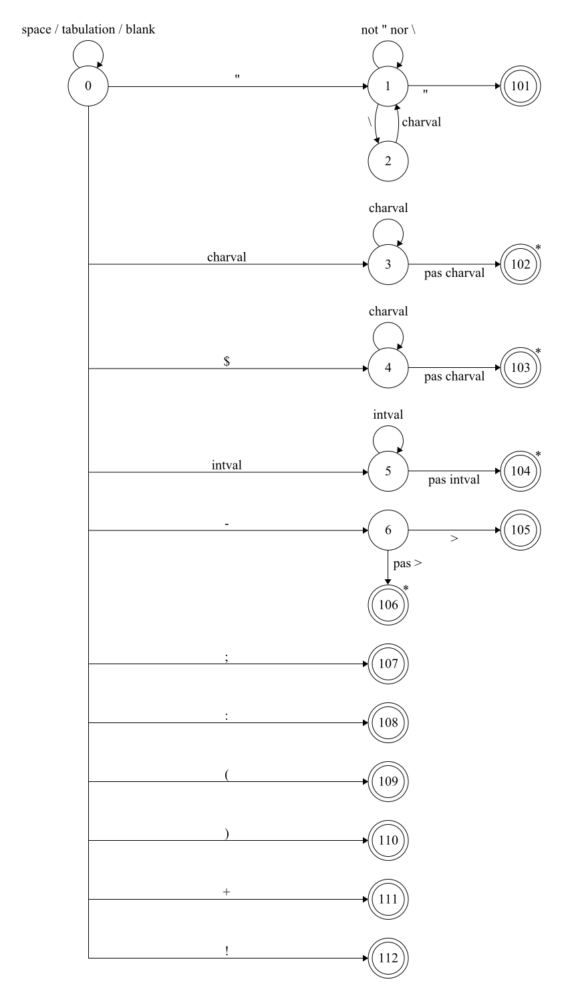

# AdventureLang

This project was developed for our third year of computer science at the University of Tours, France.

The goal was to create a language that describes a game's adventure and then to interpret it. The language itself only describe an adventure and does not implement the game. The language is interpreted by a Java program.

## Getting Started

### Prerequisites

- Java 21 (with support for Preview features like StringTemplates and Switch Expressions).
- We recommend using IntelliJ IDEA as an IDE but you can use any IDE you want.

### Installing

You can either download the project as a zip file or clone it using git.

## The language

### Syntax

The language is composed of 3 main parts : the title, the locations and the actions.

#### General syntax

Each instruction end with a semicolon `;`. The language is case sensitive. The language only accepts integers as numbers and strings must be surrounded by double quotes `"`. The language does not accept comments. You can insert new lines, tabs and spaces wherever you want. In strings, you can use the `\` character to escape the double quotes or any character. The standard escape characters are supported.

- The syntax is case sensitive and ends each instruction with a semicolon (`;`).
- Only integers are allowed for numbers; strings should be enclosed in double quotes (`"`).
- Standard escape characters are supported within strings, using the backslash (`\`) for escaping.
- The language does not support comments.
- Whitespace (new lines, tabs, spaces) can be used freely for readability.

#### The title

The title is the first line of the file. It is composed of the keyword `setTitle` followed by the title of the adventure.

Example :

```
setTitle "My adventure";
```

#### The locations

The locations are the places where the player can go. They are composed of the keyword `addLocation` followed by the identifier of the location and the description of the location.

Each location must have a unique identifier.

One location can have one or more actions.

Example :

```
addLocation 1 "You are in a dark room" [actions];
addLocation 2 "You are in a garden";
```

#### The actions

The actions are the actions that the player can do in a location. They are defined with `->` followed by the identifier of the place to go and the description of the action.

We do recommend to put the actions in a new line and add a tabulation before the action. It is not mandatory but it makes the code more readable.

Example :

```
addLocation 1 "You are in a dark room"
    -> 2 "Go to the garden"
    -> 3 "Go to the kitchen";
addLocation 2 "You are in a garden"
    -> 1 "Go to the dark room";
addLocation 3 "You are in a kitchen"
    -> 1 "Go to the dark room";
```

### The grammar

The grammar of the language is the following :

- S -> `setTitle Str;ABCD` Permet de définir le titre et définit la suite des actions
- A -> `setHealth Int;` Permet de définir la santé initiale

- B -> `FB | EB | ε` Permet de boucler sur la définition des personnages ou des objets
- E -> `addItem Var;` Permet de créer un objet
- F -> `addCharacter Var Int Int;` Permet de créer un personnage

- C -> `setInventory C’;` Permet de définir l'inventaire initial du joueur
- C’ -> `Var C’ | ε` Définit un objet pour l'inventaire du joueur

- D -> `GD | ε` Permet de boucler sur l'ajout de lieux
- G -> `addLocation Int Str IH;` Permet d'ajouter un lieu
- H -> `-> M Int Str IH | ε` Permet d'ajouter une option à un lieu

- I -> `(J) | ε`  Définit une action
- J -> `J’J | ε` Permet la possibilité de plusieurs expressions dans une action
- J’ -> `K:LVar` Définit la structure d'un condition (eg: `health:+5`, `item:+$sword` ...)
- K -> `health | item | character` Types d'action
- L -> `+ | -` Opération de l'action (ajouter / supprimer)

- M -> `(M’) | ε` Définit une condition
- M’ -> `NM’ | ε` Permet la possibilité de plusieurs expressions dans une condition
- N -> `Neg N’` Définit la structure d'une condition
- N’ -> `O | P` Permet d'avoir deux types de condition : sur les objets ou sur les personnages
- O -> `item:Var:Int` Définit une condition sur les objets (eg: `item:$sword:1`, `item:$coin:10` ...)
- P -> `character:Var` Définit une condition sur les personnages (eg: `character:$philip` ...)

- Neg -> `! | ε` Définit une négation
- Int -> `intVal Int | ε` Définit un nombre entier
- Str -> `"Str'"` Définit une chaine de caractères
- Str' -> `charVal Str' | ε`
- Var -> `$Var'` Définit une variable
- Var' -> `charVal Var' | ε`

#### The first and follow sets [PLUS A JOUR]

The first and follow sets of the grammar are the following :

| Non-terminal  | First set            | Follow set           |
|---------------|----------------------|----------------------|
| S             | {`setTitle`}         | {`$`}                |
| A             | {`addLocation`, `ε`} | {`addLocation`, `$`} |
| B             | {`addLocation`}      | {`addLocation`, `$`} |
| C             | {`->`, `ε`}          | {`;`, `->`}          |
| Int           | {`intVal`, `ε`}      | {`"`}                |
| Str           | {`"`}                | {`;`, `->`}          |
| Str'          | {`charVal`, `ε`}     | {`"`}                |

#### State machine diagram [PLUS A JOUR]

The syntax tree of the grammar is the following :



##### The accepting states [PLUS A JOUR]

| state number | accepting   |
|--------------|-------------|
| 101          | A string    |
| 102          | A keyword   |
| 103          | An integer  |
| 104          | An arrow    |
| 105          | A semicolon |

#### Translation table [PLUS A JOUR]

The translation table of the grammar is the following :

| state | space | `"`   | `\`   | `-`   | `>`   | `;`   | `intVal` | `charVal` |
|-------|-------|-------|-------|-------|-------|-------|----------|-----------|
| **0** | 0     | 1     | ❌     | 5     | ❌     | *105* | 4        | 3         |
| **1** | 1     | *101* | 2     | 1     | 1     | 1     | 1        | 1         |
| **2** | 1     | 1     | 1     | 1     | 1     | 1     | 1        | 1         |
| **3** | *102* | *102* | *102* | *102* | *102* | *102* | 3        | 3         |
| **4** | *103* | *103* | *103* | *103* | *103* | *103* | 4        | *103*     |
| **5** | ❌     | ❌     | ❌     | ❌     | *104* | ❌     | ❌        | ❌         |

The states in italic are the accepting states. Some states that are not valid are represented by a cross.
